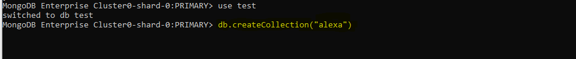
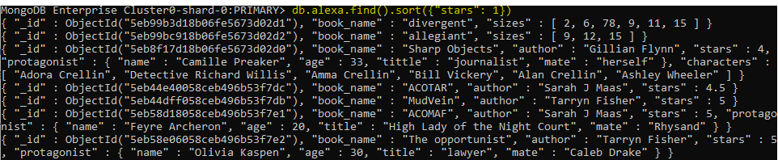
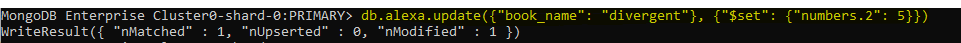

# Mongo-DB CheatSheet

This is a short and easy cheatsheet to help you learn in a fast and uncomplicated way MongoDB.

## What it's MongoDB

MongoDB is a general-purpose, document-based, distributed database that has been designed for modern application developers and the cloud era.

### Installing

To begin with, the installation it's very easy, there is an official [link](https://docs.mongodb.com/manual/administration/install-community/) where you can install it depending on your operating system.

```
Download it
```

After, I added mongoDB's bin folder to the path enviorment variable, so that I can be able to run mongo from anywhere in a command window. Since I use windows, here's another [link](https://dangphongvanthanh.wordpress.com/2017/06/12/add-mongos-bin-folder-to-the-path-environment-variable/) that could help you do the same (for windows 10 only).

```
Command Window access
```

In my case, the database used was provided by my teacher who created it in Atlas, which is a cloud database (from Mongo DB) therefore we needed access trough a link from him to use it in the cmd.

### Start

The first thing would be opening the command window and use the link provided, in my case this will do: 

```
mongo "mongodb+srv://cluster0-cdd34.mongodb.net/next" --username YourUserNameGivenByTheCreator
```
and if the creator uses a password it'll be required. 

### Commands

* **Database/Collection/Document**
  * **Show dbs** - It would pop out the list of created databases.
  
  * **use NameOfTheDatabase** - Access to the desired database.
  
  * **db.createCollection("name")** - Create a collection inside the already selected database.
  
  
* **Insert/Remove**
  * **db.name.insert({"data1": "value"})** - Insert a *document* inside the already created collection, if the colleciton was not previously created it will automatically do it. 
  
  * **db.name.insert({"data1": "value", "birthDate": new Date(1999,8,23)** - new Date(), it's from the syntax of JavaScript (Year, month(the count of months starts at 0), day). In this case, this date means: September 23rd, 1999.
  
  * **db.name.remove({"data1": "value"})** - Erase the complete *document* if the key passed ("data1": "value") is matched.
  
  
* **Find**
  * **db.name.find()** - Shows all the *documents* in that collection.
  
  * **db.name.find().pretty()** - Shows all the *documents* in that collection in json form.
  
  * **db.name.find({"data": "value"}).pretty()** - In the database, collection will find all the documents that matches what is inside the brackes. You can pass differents queries.
  
  * **db.name.find({"data": {"$gt": 20}}).pretty()** - As the previous command, this will do the same but with the difference of intead putting the excat value we want to find we can use comparison query operators (listed below). In this example the $gt operator means "greater than" so we are looking for that data we specified that is greater than 20. 
  
  * **db.name.find({"data": {$elemMatch: {"$gt": 20, "$lt": 50}}}).pretty()** - Adding the $elemMatch would make sure that AT LEAST ONE character of the array will match the range of greater than 20 and less than 50.
  
  * **db.name.find({"data": {"$gt": 20}}, {"name": true, "anotherName": true}).pretty()** - This command is the same but the extra bracket we select which elements of the document we want to be shown, the only restriction is you must only put the ones your want with "true" o the ones you don't with "false", you cannot mix them.
  
  * **db.name.find().count()** - The count as its name says, count the number of (in this case) matching documents (if something passed trough find), since nothing is passed in find it'll return the total amount of documents in the collection.
  
  * **db.name.find().sort({"data": 1}).pretty()** - The sort() cursor method to sort documents based of the "data" based. In here you can only put 1 for ascending order and -1 for descending. 
  
  * **db.name.find().limit(number).pretty()** - It'll limit the amount of documents shown at a time for the matching of the find.
  
  * **db.name.find().skip(number).limit(number).pretty()** - The skip() will skip the number passed of documents.
  
  
* **Update**:
  * **db.name.update({"data1": "value"}, {"$set": {"data": "value"}})** - To update a data from the document we fisrt pass trough the brackets any data from the document we want to update so that when it matches the result it change it; the second pair of brackets uses "$set" which is the parameter to update and inside those brackets we use another pair {} with the data we want to change and the updated value of that data.
  
  * **db.name.update({"data1": "value"}, {"$set": {"data": "value"}}, {"multi": true})** - Here we added the "multi" parameter when it's *flase* it will only update the **first** document that matches, on the hand, *true* will update **all** the document that matches.
  
  * **db.name.update({"data1": "value"}, {"$inc": {"data": NumberToIncrement})** - This will do the same as update, the difference is the parameter "$inc" that allows increment a value that is a number.
  
  * **db.name.update({"data1": "value"}, {"$unset": {"data2": ""})** - Erase an specific data from a document. The "$unset" will remove the specific data from the document, if you want to do it for all the documents add: {"multi": true}.
  
  * **db.name.update({"data1": "value"}, {"$rename": {"data2": "data3"})** - Rename tha data itself from a document with the parameter "$rename".
  
  * **db.name.update({"data1": "value"}, {"$set": {"data.2": "value"}})** - To update a value that it's inside a list that it's also a vlue from a data we use the position of the value we want to update in the list, in this example it would be the value numbers 3 (since we start counting from 0). 
  
  * **db.name.update({"data": "newValue"}, {"$set": {"data.$": "valueToChange"}}, {"multi": true})** - In case we don't know the position of the value we want to change, it's necessary that the data to match it with is the data we want to change and the new value to change and in the next brackets tha data and the sign "$" instead of the position number with the value to change.
  
  * **db.name.update({"data1": "value"}, {"$set": {"data.embeddedValue": "value"}}, {"multi": true})** - To update a value that inside a object which is also a data we use the dot with the name of the data to have access to it and change its value.
  
  * **db.name.update({"data1": "value"}, {"$pop": {"arrayName": 1}})** - The $pop operator will remove either the first or last value of an array. With 1 removes the last element and with -1 the first. This operator will only accept 1 or -1.
  
  * **db.name.update({"data1": "value"}, {"$push": {"arrayName": "newValue"}})** - The $push operator will add a new value a the end of the especified array.
  
  * **db.name.update({"data1": "value"}, {"$addToSet": {"arrayName": 1}})** - The $addToSet operator will add a value to the end of an array unless it is already present.
  
  * **db.name.update({"data1": "value"}, {"$pull": {"arrayName": 1}})** - The $pull operator will remove any instance of a value from an array (If value isn’t unique, then all instances will be removed from the array.)
  
  
* **Aggregate**:
  * **db.name.aggregate([{"$group": {"$-id": "$value"}])** - Aggregate is used ti combine data, we use $group as parameter and uses the filed id as the new characristics and the value as the new id.
  
  * **db.name.aggregate([{"$group": {"$-id": "$value", "total": {"sum": 1}}}])** - Anything specified after the group key is considered an accumulator. Accumulators take a single expression and compute the expression for grouped documents. In this case if there is a document with the same value we just passed the sum will add one.
  
  * **db.name.aggregate([{"$group": {"$-id": "$value", "total": {"sum": 1}, "total_data": {"$avg": "$data"}}}])** - You can add as many opperations as you want ($sum, $avg, $max, $min).
  
  * **db.name.aggregate([{"$match": {"data": "value"}}, {"$group": {"$-id": "$value", "total": {"sum": 1}}}])** - The aggregate method acts like a pipeline, where we can pass data through many stages in order to change it along the way. Each stage modifies the working data set and then passes the altered documents to the next stage until we get our desired result. (collection, filter and group).
  
 

## Data types 

* **Strings** - "Alexa".
* **Numbers** - 3, 3.14.
* **Booleans** - false, true.
* **Arrays** - ["apple", "coconut", "banana",...].
* **Objects** - {"name": "Alexa", "age": 20}.
* **Null** - null.
* **ObjectId(...)** - ID for each document automatically created by MongoDB.
* **ISODate(...)** - Type for dates.

## Comparison Query Operators

* **$gt** - Greater than.
* **$gte** - Greater than or equal to.
* **$ne** - No equal to.
* **$lt** - Less than.
* **$lte** - Less than or equal to.

## Authors

* Alexa Canche 

## Acknowledgments

* This is a version based on "The Magical Marverls of MongoDB" document.
